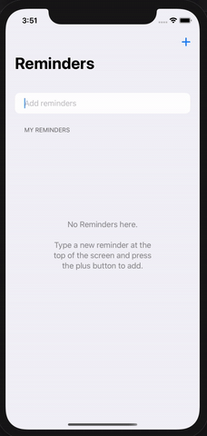

# Aprendendo CoreData com SwiftUI - Medium

## Link para o artigo completo está [aqui](https://alleypereira.medium.com/aprendendo-coredata-com-swiftui-90c9d2159714)

----
### Como contribuir

- Fork esse repositório;
- Crie uma branch com a sua feature: `git checkout -b my-feature`
- Commit suas mudanças: `git commit -m 'feat: My new feature'`
- Push a sua branch: `git push origin my-feature`
-----

### ScreenMovie

